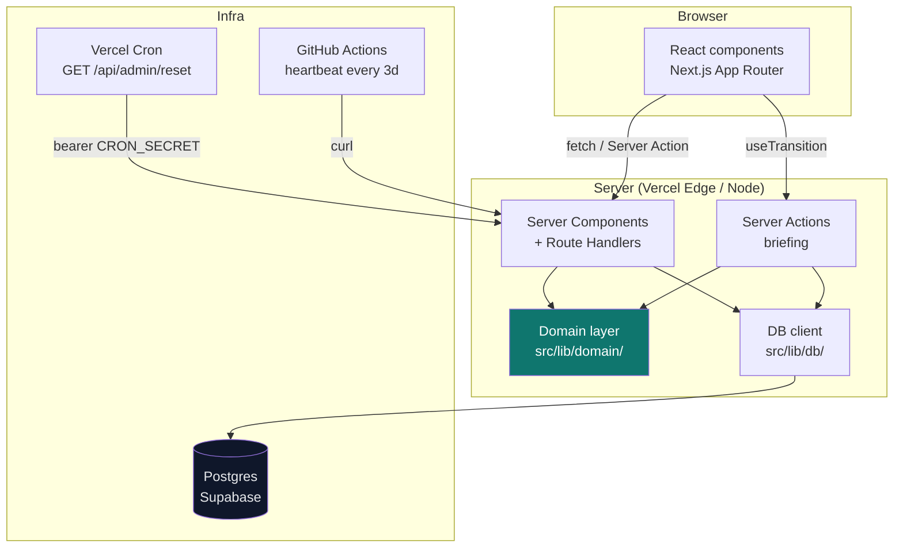

[](https://github.com/aliele14/pharmastock-kit-v2/actions/workflows/ci.yml)

<!-- DEMO GIF — record a 20-second walkthrough (see docs/WALKTHROUGH.md §Recording the demo) and drop it here -->
<!--  -->

<!-- SCREENSHOT — dashboard with a chip active -->
<!--  -->

# PharmaStock — Supply Chain Analytics

PharmaStock is a tool for keeping track of a pharmacy or warehouse's medicine stock. It shows you at a glance what's running low, what's about to expire (and how much money that represents), and what you should reorder — no spreadsheets required.

To use it, open the dashboard: every medicine is a row, and clicking one reveals its batches, expiry dates, and demand history. You can add, edit, or delete products and batches right in the app — this live version is a sandbox, so click around freely; the demo data resets every 24 hours.

I built this as an experiment — to see what I could actually create end to end, from the supply-chain math to a working app anyone can open in a browser. The whole thing was built with AI as my engineering partner (Anthropic's Claude Code), but the app itself runs on pure, deterministic code — no AI at runtime, every calculation testable and exact.

**Live demo:** https://pharmastock-kit-v2.vercel.app

A pharmaceutical inventory tracker built as a portfolio project for supply-chain and data analyst roles. It demonstrates the kind of analytics a supply analyst actually uses daily: batch/lot tracking with FEFO consumption order, expiry risk heat maps, reorder-point calculations, demand anomaly detection, and a written supply briefing — all generated by a pure, deterministic, unit-tested rules engine with no AI at runtime.

---

## Features

| Feature | Description |
|---|---|
| **F1 Inventory dashboard** | 40 products, sortable and filterable by category / supplier / status / cold-chain flag. Click any row for batch detail and a 90-day demand sparkline. |
| **F2 Batch / lot tracking** | Per product: batch numbers, quantities, expiry dates, FEFO rank (consume earliest first), expiry window badges (green / amber / red / gray). |
| **F3 Reorder intelligence** | Avg daily demand, safety stock (`SS = 1.65 × σd × √L`), reorder point (`ROP = d̄ × L + SS`), suggested order quantity — all derived from 90-day seeded demand history. |
| **F4 Supply briefing** | "Generate briefing" produces a Risks / Actions / Watchlist report assembled entirely by a typed rules engine. Deterministic: same data → same report, every time. |
| **F5 Anomaly detection** | Z-score anomaly detection on daily demand (`|z| > 2.5`, min 14 datapoints). Anomalies surface as badges on the dashboard and highlighted points on the sparkline. |
| **F6 Quick-question chips** | One-click preset filters: "Expiring ≤60 days", "Below reorder point", "Cold-chain at risk", "Top value at risk", "Demand anomalies". State is URL-encoded and bookmarkable. |
| **F7 Sandbox CRUD + auto-reset** | Visitors can add / edit / delete products and batches. A Vercel Cron resets everything every 24h. Banner keeps visitors informed. |
| **F8 Health endpoint** | `GET /api/health` — trivial DB read, returns `{ ok: true }`. Pinged every 3 days by a GitHub Actions heartbeat to prevent Supabase free-tier from pausing. |

<!-- SCREENSHOT — expiry risk page with KPI cards -->
<!--  -->

<!-- SCREENSHOT — briefing page with a generated report -->
<!--  -->

---

## Supply chain logic

All formulas live in pure functions under [`src/lib/domain/`](src/lib/domain/) and are fully covered by Vitest. No business math touches the UI layer.

### Safety stock & reorder point (F3)

```
d̄  = average daily demand over the trailing 90-day window
σd = sample standard deviation of daily demand (n − 1)
L  = supplier lead time in days

Safety stock:   SS  = 1.65 × σd × √L          (95% service level, z = 1.65)
Reorder point:  ROP = d̄ × L + SS
Suggested qty:  ⌈(d̄ × (L + 30) − stock) / pack_size⌉ × pack_size  (floor 0)

Status:  stock ≤ SS  → Critical
         stock ≤ ROP → Reorder
         otherwise   → OK
```

The 1.65 z-score targets a 95% service level — a standard pharma supply-chain assumption. Safety stock buffers against demand variability over the lead-time window; ROP triggers the order early enough to arrive before stock runs out.

### Anomaly detection (F5)

```
For each product with ≥ 14 demand datapoints over the trailing 90-day window:
  μ   = mean daily demand
  σ   = sample std dev
  z_t = (qty_t − μ) / σ    for each day t

  |z_t| > 2.5  → anomaly flagged on day t
  σ = 0        → no anomalies (constant demand, nothing to detect)
```

A 2.5σ threshold balances sensitivity against false-positive rate on sparse pharmaceutical demand data. The 14-point minimum prevents spurious flags on products with very short demand histories.

### Value at risk (F2)

```
VAR(horizon) = Σ (quantity × unit_cost)   for all batches where 0 ≤ days_to_expiry ≤ horizon

Already-expired stock (days < 0) is treated as sunk loss and shown in a separate KPI.
```

### Supply briefing rules (F4)

Five rules, each a pure function in [`src/lib/domain/briefing.ts`](src/lib/domain/briefing.ts):

| # | Condition | Section |
|---|---|---|
| 1 | VAR ≤30 days > €5,000 | Risks |
| 2 | Any product at Critical status | Actions |
| 3 | Any product at Reorder status | Actions |
| 4 | Demand anomalies in the last 14 days | Watchlist |
| 5 | Cold-chain products expiring ≤60 days | Risks |

If none fire, an explicit healthy-state summary is emitted (the report is never blank). Each rule interpolates real numbers into a template sentence — no string generation, no LLM.

---

## Why no LLM at runtime

A natural-language briefing generated by an LLM sounds impressive until you ask: is it correct? Supply chain decisions (ordering stock, escalating expiry risk) need to be traceable. A deterministic rules engine gives you:

- **Exactness** — ROP and safety stock are computed from the defined formula, not approximated.
- **Testability** — every rule has a Vitest unit test; the full briefing is snapshot-tested against a fixed inventory.
- **Auditability** — a hiring manager can read `briefing.ts` and verify the logic in minutes.
- **Cost** — zero inference cost, zero latency, works offline.

An optional LLM layer (natural-language queries, narrative summaries) is a scoped roadmap item (see below) — but it would sit *on top of* the deterministic engine, not replace it.

---

## Architecture



**Key constraint:** `src/lib/db/client.ts` is guarded by the `server-only` package. Any accidental import into a browser bundle causes a build error — the `SUPABASE_SERVICE_ROLE_KEY` can never reach the client.

---

## Tech stack

| Layer | Choice | Why |
|---|---|---|
| Framework | Next.js 16 (App Router) | RSC + Server Actions remove the need for an API layer for most reads |
| Language | TypeScript (strict + `noUncheckedIndexedAccess`) | Domain layer does array index math; forcing undefined-checks prevents a class of bugs |
| Styling | Tailwind CSS v4 | Utility-first, dark mode via class, no runtime overhead |
| Database | Postgres on Supabase | Free-tier Postgres, server-side access only via service role key |
| Charting | Recharts | Lightweight; sparklines only — no heavy chart library needed |
| Validation | Zod | Typed parse at every API boundary |
| Testing | Vitest | Fast; aligns with Vite's ecosystem used by Next.js tooling |
| CI | GitHub Actions | Free for public repos; lint + typecheck + test on every push |
| Deploy | Vercel Hobby | Free, zero-config Next.js deployment with native Cron support |

---

## How this was built

This project was built using **Claude Code** (Anthropic's CLI for AI-assisted development) in phased weekend sessions, following a disciplined engineering process:

1. **Phase 1** — data model, DB layer, domain logic (safety stock, FEFO, briefing rules), seed script, and the dashboard UI.
2. **Phase 2** — anomaly detection (z-score), briefing engine, CRUD routes, quick-question chips, and the remaining pages.
3. **Phase 3** — responsive polish, PWA basics, CI/CD, README, and this documentation.

**Dual-model audit protocol.** After each phase, two independent audit sessions ran using different models (Claude Opus and Claude Sonnet) against the same `prompts/audit.md` checklist — covering correctness, security, accessibility, and test coverage. Reports are committed in [`docs/audit/`](docs/audit/). Neither audit session could write code; findings were triaged by a human (Alina) and addressed in a separate fix session.

**Human-in-the-loop triage.** Every non-trivial fix required a stop, a plain-language explanation of the options, and explicit approval before code was written. No unilateral scope changes. The [decisions journal](docs/DECISIONS.md) records every non-obvious choice.

**Runtime is AI-free.** The deliberate choice to keep runtime logic deterministic and rule-based is itself a feature, not a limitation — it makes the code reviewable by any engineer, not just those familiar with prompt engineering. The LLM layer (if ever added) would be a clearly-scoped module on top of the existing engine, not woven through it.

This approach — phased delivery, independent audits with committed reports, human-in-the-loop control — is replicable on any engineering team and is the answer to "how do you use AI responsibly?"

---

## Roadmap (non-goals for MVP)

Items intentionally deferred to show product judgment:

- **Authentication / multi-user** — single public sandbox is enough for a portfolio demo
- **ML demand forecasting** — ARIMA / Prophet would replace the simple rolling average; interesting but out of scope
- **Optional LLM layer** — natural-language queries ("show me everything expiring this month") and narrative briefings sitting on top of the deterministic engine
- **Email / Slack notifications** — trigger alerts when a product hits Critical
- **CSV import / export** — useful for real deployments
- **Multi-warehouse** — the data model supports it via a `location` column on batches; the UI does not

---

## Local development

### Prerequisites

- Node.js ≥ 20
- A Supabase project (free tier is fine)

### Setup

```bash
git clone https://github.com/aliele14/pharmastock-kit-v2.git
cd pharmastock-kit-v2
npm install
```

Create `.env.local` (never committed):

```
SUPABASE_URL=https://<your-project-ref>.supabase.co
SUPABASE_SERVICE_ROLE_KEY=<your-service-role-key>
CRON_SECRET=<any-random-secret-you-choose>
```

Run the database migration (apply `supabase/migrations/20260612120000_initial_schema.sql` in the Supabase SQL editor), then seed demo data:

```bash
npm run seed       # idempotent — safe to run repeatedly
npm run dev        # http://localhost:3000
```

### Scripts

| Script | Purpose |
|---|---|
| `npm run dev` | Local dev server |
| `npm run build` | Production build |
| `npm run lint` | ESLint |
| `npm run typecheck` | `tsc --noEmit` |
| `npm run test` | Vitest (single run) |
| `npm run coverage` | Vitest with V8 coverage |
| `npm run seed` | Idempotent demo data seed / reset |

### Deploying to Vercel

See the step-by-step checklist in [`docs/WALKTHROUGH.md`](docs/WALKTHROUGH.md) (§ Deploy checklist).
